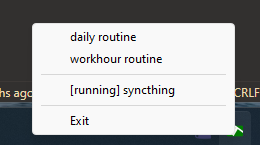

# JigsawWM

JigsawWM is a dynamic window manager for Windows10/11 just like the suckless dwm for the X.

## Demo

https://user-images.githubusercontent.com/61080/210168366-e70dd649-f6ef-41bb-a8e5-941e392d770a.mp4

## Installation

Tested on **Windows 11 Build 22000** and **Python 3.11.1**.
Should work on **Windows 10** and **Python 3.8**


Install from pypi
```
pip install jigsawwm
```

Install from github repo
```
pip install git+https://github.com/klesh/JigsawWM.git
```

## Quick Start

**JigsawWm** follows the [suckless philosophy](https://suckless.org/philosophy/) and works just like [dwm - dynamic window manager | suckless.org software that sucks less](https://dwm.suckless.org/). All windows are treated as a `Ordered List`, they will be moved into places based on their `Order` and specified `Layout` **automatically** to improve your productivity.


### Step 1: Create a `.pyw` file as the "Configuration"

1. Download the [example.pyw](src/example.pyw) to your local hard drive
2. Edit the code as you see fit
3. Double-click the file and it should launch with a tray icon, or you may have to create a file association to the `Python` program
4. Create a shortcut in your `Startup` folder if you like it

### Step 2: Using hotkeys to manage your windows

- `Win + j`: activate next window and move cursor to its center
- `Win + k`: activate previous window and move cursor to its center
- `Win + Shift + j`: move active window down in the list / swap with the next one
- `Win + Shift + k`: move active window up in the list / swap with the previous one
- `Win + n`: minimized active window
- `Win + m`: maximize/unmaximized active window
- `Win + /`: swap active window with **first window** in the list or **second window** if it is the first window already
- `Win + q`: kill active window
- `Win + Space`: next theme, `Theme` consists of `Layout`, `Background`, `gap`, etc. to determine how windows should be placed
- `Win + i`: activate first window of the next monitor if any or move cursor only
- `Win + u`: activate first window of the previous monitor if any or move cursor only
- `Win + Shift + i`: move active window to next monitor
- `Win + Shift + u`: move active window to previous monitor
- `Win + Control + i`: inspect active window

### Step 3: Launch at startup

1. Open your **Startup** folder by pressing `Win + r` to activate the **Run** dialog and type in `shell:startup`, a FileExplorer should pop up.
2. Create a shortcut to your `.pyw` file. Done!


## Useful features:

### Services

To run a console program (e.g. syncthing) in the background as a service

```python
from jigsawwm.daemon import Daemon

class MyDaemon(Daemon):
    def setup(self):
        from jigsawwm.services import ServiceEntry, register_service
        register_service(
            ServiceEntry(
                name="syncthing",
                args=[
                    r"C:\Programs\syncthing-windows-amd64-v1.23.2\syncthing.exe",
                    "-no-browser",
                    "-no-restart",
                    "-no-upgrade",
                ],
                log_path=r"C:\Programs\syncthing-windows-amd64-v1.23.2\syncthing.log",
            )
        )

MyDaemon(Daemon)
```

### Smart Start

To launch apps/tasks at login conditionally

1. Say I have a folder named `daily` in my Chrome bookmark bar, I would like it to be opened automatically upon booting up my computer first time each day.
```python
from jigsawwm.daemon import Daemon

class MyDaemon(Daemon):
    def setup(self):
        from jigsawwm.smartstart import (
            SmartStartEntry,
            daily_once,
            open_chrome_fav_folder,
            register_smartstart,
        )
        register_smartstart(
            SmartStartEntry(
                name="daily routine",
                launch=lambda: open_chrome_fav_folder("bookmark_bar", "daily"),
                condition=lambda: daily_once("daily websites"),
            )
        )

MyDaemon(Daemon)
```
2. I would like a couple of apps/tasks to be launched automatically if I boot up my computer within work hours.
```python

        holiday_book = ChinaHolidayBook()

        def open_worklog():
            """Open worklog (a markdown file) for today (create if it doesn't exist yet)."""
            next_workday = holiday_book.next_workday()
            latest_workday = holiday_book.latest_workday()
            worklog_path = os.path.join(
                os.path.expanduser("~/Documents/Sync/worklog"),
                f"{next_workday.isoformat()}.md",
            )
            if not os.path.exists(worklog_path):
                with open(worklog_path, "w") as f:
                    prevdate = latest_workday.strftime("%m/%d")
                    nextdate = next_workday.strftime("%m/%d")
                    f.write(f"{prevdate}\n1. \n\n{nextdate}\n1. ")
            os.startfile(worklog_path)

        register_smartstart(
            SmartStartEntry(
                name="workhour routine",
                launch=[
                    r"C:\Users\Klesh\AppData\Local\Feishu\Feishu.exe",
                    r"C:\Program Files\Mozilla Thunderbird\thunderbird.exe",
                    open_worklog,
                ],
                # in case I might boot up the computer a little bit earlier
                condition=lambda: holiday_book.is_workhour(extend=timedelta(hours=2)),
            )
        )

```

### Tray menu



Functionalities:

1. Stop/start a `service` 
2. Run a `smartstart` without condition


## Document

[Read the Docs](https://jigsawwm.readthedocs.io/en/latest/)


## Changelog

### 2023-04-05

- add `smartstart` feature
- BREAKING CHANGE: rename `svcmgr` to `services`
- adopt `pyproject.toml`

### 2023-03-21

- add `svcmgr` feature

### 2023-02-02

- support portrait mode monitor (rotate layout by 90 degree)
- update readme